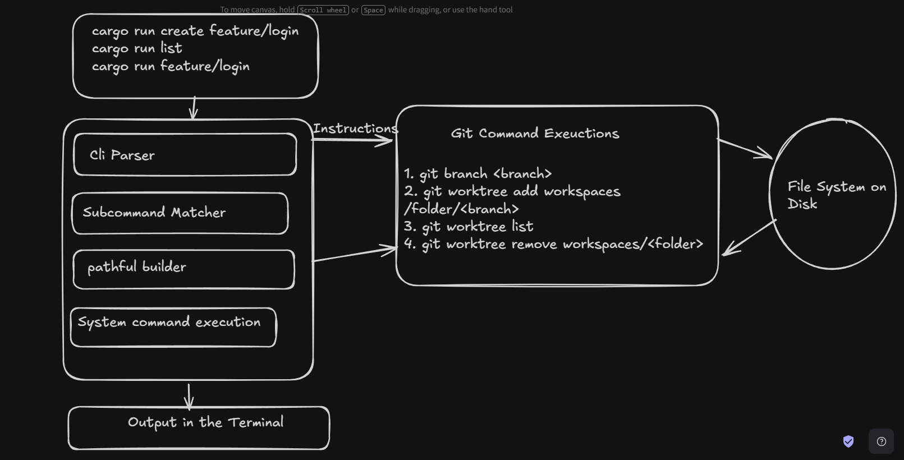

## GIT WORKTREE MANAGER

A simple, fast **Command Line Interface (CLI)** built in Rust to automate and simplify managing Git worktrees. Worktrees allow you to work on multiple branches simultaneously in separate directories without switching branches or stashing uncommitted changes.


## PURPOSE

Managing Git **worktrees** natively requires remembering and typing multi-step Git commands. This tool automates the process into single, intuitive CLI commands:

- Automatically extracts clean directory names from branch paths (e.g., `feature/login` ➔ `workspaces/login`).
- Handles branch and worktree creation in one go.
- Eliminates context-switching overhead and stashing headaches.


## Necessary commands to Run

# Create another worktree
cargo run -- create feature/payment


**NOTE** - Run the `git add .` and the `git commit -m "your_message"`

# List active worktrees
cargo run -- list

# Clean up / remove a worktree
cargo run -- remove feature/login


## Quick Start

1. Ensure you have **Rust** and **Git** installed.
2. Clone this repository and make at least one initial commit:
   ```bash
   git add .
   git commit -m "Initial commit"
```

## Architecture

